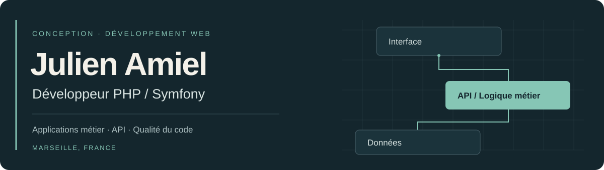
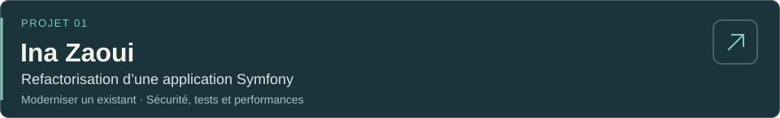
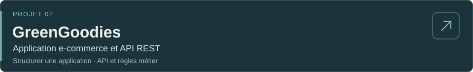
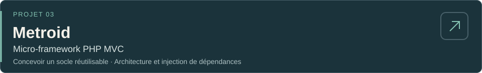

  

  <strong>PHP / Symfony</strong> &nbsp; · &nbsp; API REST &nbsp; · &nbsp; WordPress

Deux ans d’expérience en alternance chez Inetum, consacrés au développement et à l’évolution d’applications web. Je recherche aujourd’hui un **CDI en développement PHP / Symfony**, à Marseille et dans ses environs. Disponible immédiatement.

  <a href="https://www.linkedin.com/in/julien-amiel-dev/"><strong>Échanger sur LinkedIn ↗</strong></a> &nbsp; / &nbsp;
  <a href="https://github.com/Corvaxx117?tab=repositories">Explorer mes dépôts ↗</a>

---

## 

**Inetum — Développeur PHP / Symfony en alternance · 2 ans**

- Rédaction de notes de cadrage et estimation des temps de développement, en collaboration avec le client et l’équipe jusqu’à la validation des fonctionnalités.
- Développement de modules métier et d’administration Symfony, avec traitement et sécurisation des données utilisateurs.
- Conception du module **Troc** : annonces d’échange, de location, de don ou de vente de biens et services, filtres par catégorie et lieu, gestion des favoris.
- Intégration d’API et de Firebase pour l’envoi de notifications.
- Réalisation d’interfaces à partir de maquettes Figma ; développements WordPress avec plugins personnalisés, WPForms et Elementor.
- Maintenance et montées de version de frameworks, avec mise en place de tests de non-régression et de pipelines d’intégration continue (CI).

## 

### 

Reprise d’un site de photographie dans le cadre de ma formation : migration de Symfony, authentification en base de données, gestion des invités et contrôle des accès aux médias.

- Validation des fichiers envoyés et gestion des permissions selon l’utilisateur.
- Correction d’un problème de requêtes SQL N+1 sur la page des invités.
- Tests unitaires et fonctionnels, analyse statique et intégration continue avec GitHub Actions.
- Documentation d’installation, de contribution et des choix techniques.

**PHP · Symfony · Doctrine · PHPUnit · PHPStan · GitHub Actions**

---

### 

Projet de formation organisé en deux applications : une interface Symfony/Twig et une API qui centralise les données et la logique métier.

- Catalogue, panier, commandes et espace commerçant.
- Authentification par JWT et accès partenaire distinct par clé API.
- Séparation des responsabilités entre l’interface, les échanges HTTP et la persistance.

**PHP · Symfony · API Platform · Doctrine · Twig · JWT**

---

### 

Conception d’un micro-framework PHP orienté objet, inspiré de Symfony, pour créer des applications web à partir d’un socle réutilisable.

- Routage configurable en YAML, objets Request/Response et gestion centralisée des erreurs.
- Conteneur de services avec injection automatique des dépendances et moteur de rendu de vues.
- Séparation du cœur du framework et du [squelette d’application](https://github.com/Corvaxx117/metroid-webapp-skeleton), installables avec Composer.
- Utilisé pour développer [**TomTroc**](https://github.com/Corvaxx117/Tom-Troc), une plateforme d’échange de livres avec comptes utilisateurs et messagerie.

**PHP · POO · MVC · Injection de dépendances · Composer**

---

## 

| Domaine | Technologies et pratiques |
| --- | --- |
| Backend | PHP, Symfony, Doctrine, API Platform, API REST, Composer |
| Données | SQL, MySQL, PostgreSQL, modélisation relationnelle |
| Qualité | PHPUnit, PHPStan, débogage, refactorisation, documentation |
| Web et CMS | Twig, JavaScript, HTML/CSS, intégration de maquettes Figma, WordPress, WPForms, Elementor |
| Travail en équipe | Git, GitLab, GitHub Actions, Jira, méthodes agiles |
| Environnement | Docker, Linux, PhpStorm |

---

En dehors du développement, je compose de la musique. [Écouter mes morceaux](https://linktr.ee/Aveemana).
